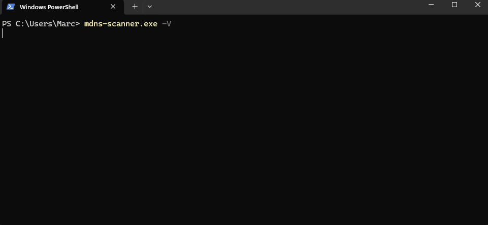

<div align=right>Table of Contents↗️</div>

<h1 align=center>MDNS Scanner

<code>mdns-scanner</code>

</h1>

<div align="center">
    <a href="https://github.com/CramBL/mdns-scanner/releases" title="Latest Stable GitHub Release">
      
    </a>
    <a href=https://github.com/CramBL/mdns-scanner/actions>
    
  </a>
    <a href=https://codecov.io/github/CramBL/mdns-scanner>
    
  </a>
</div>
<div align="center">
    &thinsp;
    &thinsp;
    
</div>

## Purpose

Scan a network and create a list of IPs and associated hostnames, including DNS-SD service instances, mDNS hostnames and other aliases.

## Demo



## Install

>[!NOTE]
> Windows has a runtime dependency on the [Npcap packet capture library](https://npcap.com/)

### 📥 Prebuilt binaries

Prebuilt binaries for Linux, MacOS, and Windows can be found on [the releases page](https://github.com/CramBL/mdns-scanner/releases).

Install the latest version with the standalone installer:

```bash
# On 🍎 macOS and 🐧 Linux.
curl --proto '=https' --tlsv1.2 -LsSf https://github.com/CramBL/mdns-scanner/releases/latest/download/mdns-scanner-installer.sh | sh
```

```bash
# On 🖥️ Windows.
powershell -ExecutionPolicy Bypass -c "irm https://github.com/CramBL/mdns-scanner/releases/latest/download/mdns-scanner-installer.ps1 | iex"
```

If installed via the standalone installer, `mdns-scanner` can update itself to the latest version:

```console
mdns-scanner update
```

### With `cargo`

`mdns-scanner` is available via Cargo, but must be built from Git rather than [crates.io](https://crates.io/) due to its dependency on unpublished crates.

```console
cargo install --git https://github.com/CramBL/mdns-scanner mdns-scanner
```

## Quickstart

Simply run it.

`mdns-scanner` will start scanning any non-loopback network interfaces for IPs with a host on the other end, and resolve the hostnames for those IPs.

> [!TIP]
> Inform your resident sys admin that you're about to run hundreds of IP scans per second.

## Configuration

View the default config file: [./docs/default_config.toml](./docs/default_config.toml)

... or dump the default configuration file to stdout, or add the `-o`/`--output` option to write it to a file.

```console
mdns-scanner dump-default-config [--output <FILE>]
```

The config can be placed in the user config directory, dump the config or see the [default_config.toml](./docs/default_config.toml) for where that is for your system.

The command-line arguments take precedence over configuration files, after looking for `mdns-scanner.toml` in the user config directory, any command-line arguments are applied to the final configuration.
